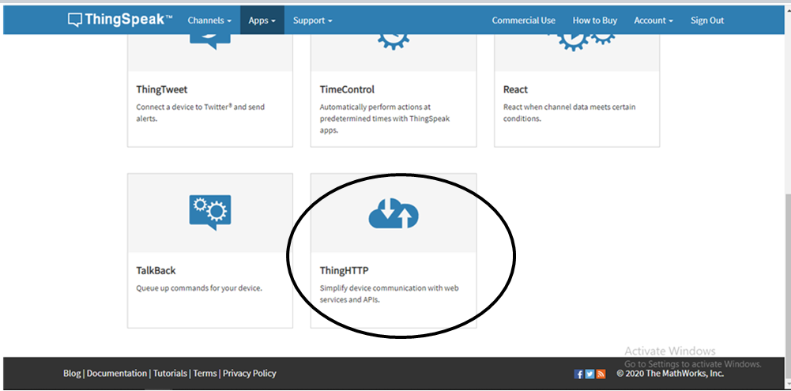

# saurabhg05
# COVID-19 Data (esp8266)
COVID19 Data using esp8266 and oled display

Coronavirus disease (COVID-19) is an infectious disease caused by a new virus.

Most people infected with the COVID-19 virus will experience mild to moderate respiratory illness and recover without requiring special treatment. Older people, and those with underlying medical problems like cardiovascular disease, diabetes, chronic respiratory disease, and cancer are more likely to develop serious illness.

The best way to prevent and slow down transmission is be well informed about the COVID-19 virus, the disease it causes and how it spreads. Protect yourself and others from infection by washing your hands or using an alcohol based rub frequently and not touching your face.

The COVID-19 virus spreads primarily through droplets of saliva or discharge from the nose when an infected person coughs or sneezes, so it’s important that you also practice respiratory etiquette (for example, by coughing into a flexed elbow).

At this time, there are no specific vaccines or treatments for COVID-19. However, there are many ongoing clinical trials evaluating potential treatments. WHO will continue to provide updated information as soon as clinical findings become available.

Information from: https://www.who.int/health-topics/coronavirus

# About the Project
COVID19 is spreading very rapidly but most of the Indian people are unaware about it. So to make them aware and give them the current statistics this project as been developed. This project is completely based on Realtime data from the Ministry of Family Welfare & Health through API (via Thingspeak) and the stats are displayed on the OLED Display. The main controller is the NodeMCU.
Links of the Libraries.
1. ESP8266WiFi.h Lib: https://github.com/ekstrand/ESP8266wifi
2. Adafruit_GFX.h Lib: https://bit.ly/2UhgvLq
3. Adafruit_SSD1306.h Lib: https://bit.ly/2Uhb8Mc

# hardware 
1. esp8266
2. OLED 0.96 i2c display

# directions

1.first get into the https://www.mohfw.gov.in/ right click on the given number and inspect the copy the xpath.

2.go to https://thingspeak.com/ create your free account then click on apps -> ThingsHTTP .

3.click on new thing.

4.enter the name , url , and xpath into Parse String.

5.it would genrate API key copy.
6.genrate API key similarly for other values.

7.past those API keys in the place of "xxxxxxxxx" as per instructed in the comment.
